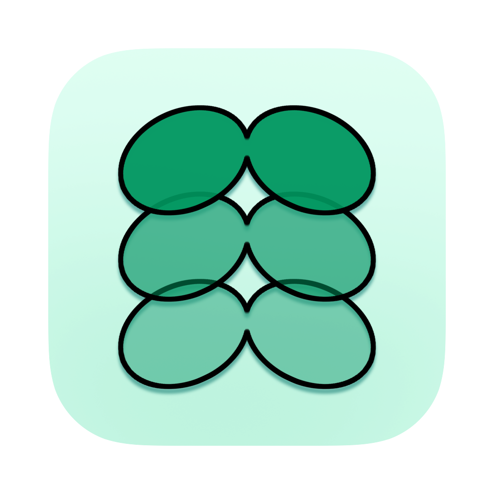

# Sprouts サポート

Sproutsは、画像、PDF、PSDなどをMac内で変換するmacOSアプリです。入力ファイルを外部サーバーへ送信しません。

[English](#english) | [プライバシーポリシー](privacy/) | [不具合を報告する](https://github.com/wentzinc-dev/Sprouts/issues/new)

## 基本的な使い方

1. PNG、JPG、PDF、PSD、TIFF、GIF、WebP、または対応ファイルを含むフォルダをドロップします。
2. 保存サイズ、出力形式、カラー、保存先を選びます。
3. 必要に応じて「詳細設定」を開きます。
4. 右側の詳細表示で出力予定と注意事項を確認します。
5. 「画像を書き出す」を押します。

入力と出力は複数形式をまとめて処理できます。既存ファイルは上書きせず、同名の場合は番号を付けます。

「形式ごとのフォルダを作成し、そこへ書き出す」は初期値ONです。「同じ場所に保存」では入力元の隣に、「フォルダを選択」では選択先の直下に、`JPG`、`PNG`、`TIFF`、`WebP`フォルダを作ります。フォルダ構成維持を併用すると、元の階層は各形式フォルダの内側へ作成されます。

## 保存サイズの違い

すべてのモードで縦横比を維持します。

| 設定 | 動作 | 小さい画像 |
|---|---|---|
| パーセント | 元サイズに対する倍率 | 100%を超える指定は現在、元サイズを上限とします |
| 長辺ピクセル | 長辺を指定値へ合わせる | 拡大する |
| 短辺ピクセル | 短辺を指定値へ合わせる | 拡大する |
| 長辺px以内 | 長辺の上限 | 拡大しない |
| 短辺px以内 | 短辺の上限 | 拡大しない |
| 幅／高さ | 指定した辺を指定値へ合わせる | 拡大する |
| 幅／高さpx以内 | 指定した辺の上限 | 拡大しない |
| 解像度（PPI） | 指定PPI ÷ 元PPIでピクセル寸法を変更 | 必要に応じて拡大する |

例：長辺1200pxの画像に「長辺2400px」を指定すると、長辺2400pxへ拡大します。「長辺2400px以内」では1200pxのままです。

アップスケールは存在しない細部を復元するものではありません。ぼけ、輪郭の甘さ、JPEGノイズなどが目立つ場合があります。

## PDF・PSD・TIFF・GIF

- PDF：指定PPIでページごとに画像化した後、保存サイズを適用します。文字やベクターもピクセル画像へ統合されます。
- PSD：Photoshop保存時の統合画像を使用します。レイヤー、マスク、スマートオブジェクトなどは保持しません。統合画像のないPSDは開けない場合があります。
- TIFF：レイヤーを保持しません。複数画像を格納したTIFFは各画像を書き出します。
- GIF：アニメーションは保持せず、先頭フレームを使用します。

## カラーと形式

- JPGは透過を保持できません。
- PNG圧縮率は画質を変えず、処理時間とファイル容量に影響します。
- WebP品質は非可逆圧縮の品質です。
- ICCプロファイルを埋め込まない場合、ほかのアプリで色の見え方が変わる可能性があります。
- Sproutsのリサイズ方式はAppleの画像処理を利用するため、Photoshopの同名方式と完全には一致しません。

## 保存できない場合

- 「フォルダを選択」で、書き込み可能な保存先を明示的に選んでください。
- 同じ場所へ保存する場合、macOSからアクセス許可を求められたら入力元の親フォルダを選択してください。
- 外付けディスクやクラウドフォルダでは、Finderで書き込み権限と同期状態を確認してください。
- 古いアイコンや画面が残る場合は、Xcodeの **Product > Clean Build Folder** 後に再ビルドしてください。

## プライバシー

変換はMac内で完結します。Sproutsは入力ファイルをネットワークへ送信せず、ファイル変換のためのネットワーク権限も使用しません。

## お問い合わせ

SproutsはWENTZ, K.K.が提供しています。不具合、一般的なお問い合わせ、機能のご要望は[GitHub Issues](https://github.com/wentzinc-dev/Sprouts/issues/new)へ投稿してください。再現手順、macOSのバージョン、入力形式、選択した設定、表示されたログを添えると調査しやすくなります。機密ファイルは添付しないでください。

---

# English

Sprouts is a native macOS converter for images, PDF, and PSD. Processing stays on your Mac; input files are not uploaded.

## Quick start

1. Drop PNG, JPG, PDF, PSD, TIFF, GIF, WebP, or folders containing supported files.
2. Choose the save size, output formats, color profile, and destination.
3. Open Advanced Settings when needed.
4. Review the output summary and warnings.
5. Click Export images.

Create a folder for each format is enabled by default. Format folders are created beside source files or directly inside the chosen destination. When Preserve Folder Structure is enabled, the source hierarchy is recreated inside each format folder.

## Size modes

Aspect ratio is always preserved. Long Edge Pixels and Short Edge Pixels resize to the exact requested edge and can enlarge smaller images. The Maximum variants only reduce images that exceed the limit. Width and Height can enlarge; their Maximum variants cannot. PPI mode changes pixel dimensions by target PPI divided by source PPI. Images without PPI metadata are treated as 72 ppi.

Upscaling cannot recreate missing detail and may magnify softness or compression artifacts. Sprouts uses Apple imaging, so resize methods are not numerically identical to Photoshop methods with similar names.

## Format notes

- PDF pages are rasterized at the selected PPI and then resized.
- PSD uses the saved composite image; layers and editable structures are not preserved.
- TIFF layers are not preserved. Multi-image TIFF files produce one output per image.
- Animated GIF uses the first frame only.
- JPEG cannot preserve transparency.

## Troubleshooting and contact

If Sprouts cannot save, explicitly choose a writable destination folder and approve macOS folder access when requested. Sprouts is provided by WENTZ, K.K. For bugs, general support, and feature requests, open a [GitHub Issue](https://github.com/wentzinc-dev/Sprouts/issues/new) with reproduction steps, macOS version, input format, settings, and the displayed log. Do not attach confidential source files.
